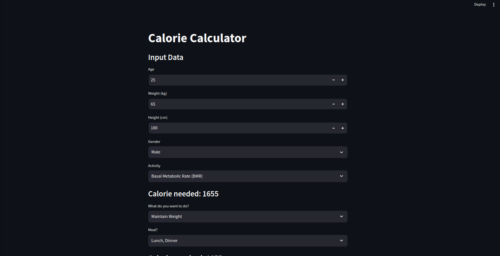

# Meal Planner using Streamlit and Edamam API

This project is a meal planning application built with Streamlit that generates a 7-day meal plan based on the user's daily calorie requirements. It leverages the Edamam API to fetch nutritional information and recipes for the meal plan.

## Table of Contents
- [Introduction](#introduction)
- [Features](#features)
- [Installation](#installation)
- [Usage](#usage)
- [Screenshots](#screenshots)
- [License](#license)

## Introduction

The Meal Planner application helps users create a balanced and healthy 7-day meal plan tailored to their specific caloric needs. By inputting basic personal details, the application calculates the daily calorie requirement and generates a meal plan accordingly.

## Features

- **Calorie Calculation**: Users input their age, gender, weight, height, and activity level to calculate their daily caloric needs.
- **7-Day Meal Plan**: Generates a weekly meal plan that meets the calculated caloric requirements.
- **Recipe and Nutritional Information**: Each meal in the plan includes recipes and detailed nutritional information fetched from the Edamam API.
- **Interactive and User-Friendly**: Built with Streamlit, offering a responsive and intuitive user interface.

## Installation

To run the Meal Planner application, follow these steps:


1. Clone the project

```bash
  git clone https://link-to-project
```

2. Go to the project directory

```bash
  cd my-project
```

3. Install dependencies

```bash
  pip install -r requirements.txt
```


4. Set up the Edamam API credentials:

* Obtain an API ID and API Key from Edamam Recipe Search API.
* Rename a file named .env.sample to .env in the project root directory and add your credentials:

```env
EDAMAM_API_ID=your_api_id
EDAMAM_API_KEY=your_api_key
```

5. Start the server

```bash
  streamlit run app.py
```

## Usage

1. Open your web browser and navigate to http://localhost:8501.

2. Input your details:

* Enter age, gender, weight, height, and activity level.

3. Generate Meal Plan:

* Click on the button to generate your personalized 7-day meal plan.


## Screenshots


## License

[MIT](./LICENSE)

